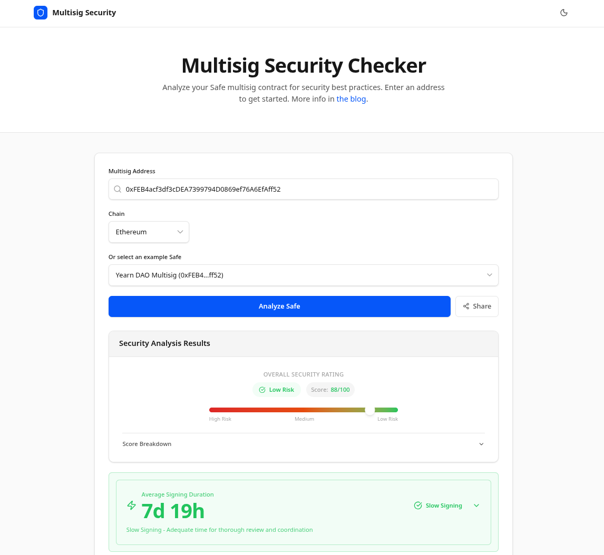

# Multisig Security Checker

Security analyzer for Safe (formerly Gnosis Safe) multisig wallets. Paste a Safe address, choose a network, and get an opinionated security review that highlights risky configurations.

**Live app:** [safe.yaudit.dev](https://safe.yaudit.dev)

Further information about the analysis is available in this post: https://blog.yaudit.dev/multisig-security.



## Key Capabilities

- **Deep Safe introspection** – batch RPC calls retrieve the Safe version, owner set, signing threshold, nonce, enabled modules, guard, and fallback handler.
- **Security heuristics** – sixteen checks score each Safe on threshold quality, signing speed, proxy factory provenance, owner activity, EOA vs contract signers, optional modules, fallback handler provenance, emergency recovery settings, and more.
- **Signing speed analysis** – measures average time between first and last confirmation across recent transactions to flag potential signer centralization.
- **Factory verification** – checks whether the Safe was deployed by an official Safe proxy factory, with version-aware scoring for versions where no factory addresses are catalogued.
- **Cross-chain awareness** – detects deployments across Ethereum, Base, Arbitrum, Optimism, Polygon, BNB Chain, Sonic, and Katana, then warns when signers are reused between chains (replay-attack risk).
- **Fresh data sources** – combines viem RPC calls, Safe Protocol Kit helpers, Safe Transaction Service APIs, GitHub release metadata, and Etherscan-style explorer APIs with rate limiting and RPC fallbacks.
- **Human-friendly UX** – color-coded score bar, hover tooltips that explain every check, and curated example Safes for each chain so you can demo the tool instantly.

## Stack

- [Next.js 15](https://nextjs.org/) App Router with React 19 and TypeScript
- [viem](https://viem.sh/) for RPC reads and multicall batching
- [@safe-global/protocol-kit](https://github.com/safe-global/safe-core-sdk) for Safe-specific helpers
- Tailwind-style utility classes for styling (see `src/app/globals.css`)

## Getting Started

1. **Prerequisites**
   - Node.js 20+
   - `pnpm` (preferred) or `npm`/`yarn`

2. **Install dependencies**
   ```bash
   pnpm install
   ```
   > Use `npm install` or `yarn install` if you prefer those package managers.

3. **Environment variables**
   Create `.env.local` and set an explorer API key (shared across Etherscan-family explorers):
   ```bash
   NEXT_PUBLIC_ETHERSCAN_API_KEY=YourApiKeyToken
   ```
   The app falls back to `YourApiKeyToken`, but supplying a real key avoids tight rate limits when fetching historical tx data.

4. **Run the dev server**
   ```bash
   pnpm dev
   ```
   Visit `http://localhost:3000`, choose a chain, and load a Safe address (or pick one from the example list).

5. **Production build**
   ```bash
   pnpm build
   pnpm start
   ```

## API Usage

All functionality is exposed through the built-in API route:

```
GET /api/[chainId]/[address]
```

- `chainId`: numeric ID from `SUPPORTED_CHAINS` (1, 10, 56, 137, 146, 8453, 42161, 747474).
- `address`: Safe contract address (checksum format preferred).

Example request (hosted):

```bash
curl https://safe.yaudit.dev/api/1/0x73b047fe6337183A454c5217241D780a932777bD/
```

Or against a local dev server:

```bash
curl http://localhost:3000/api/1/0x73b047fe6337183A454c5217241D780a932777bD/
```

Response payload:

- `safeInfo`: version, threshold, owners, nonce, modules, guard, fallback handler.
- `securityScore`: aggregate score (0–100) using the Cumulative Risk Penalty algorithm, qualitative rating (`Low Risk` / `Medium Risk` / `High Risk`), per-check penalty breakdown, and critical issue count.
- `checks`: array of sixteen security checks, each with `status` (`success`, `warning`, `error`) and a descriptive message.

This makes it easy to plug the analyzer into monitoring scripts or dashboards without scraping the UI.

## Feedback

For feature requests or bug reports, DM `@engn33r` on X or open an issue/PR in this repo.

